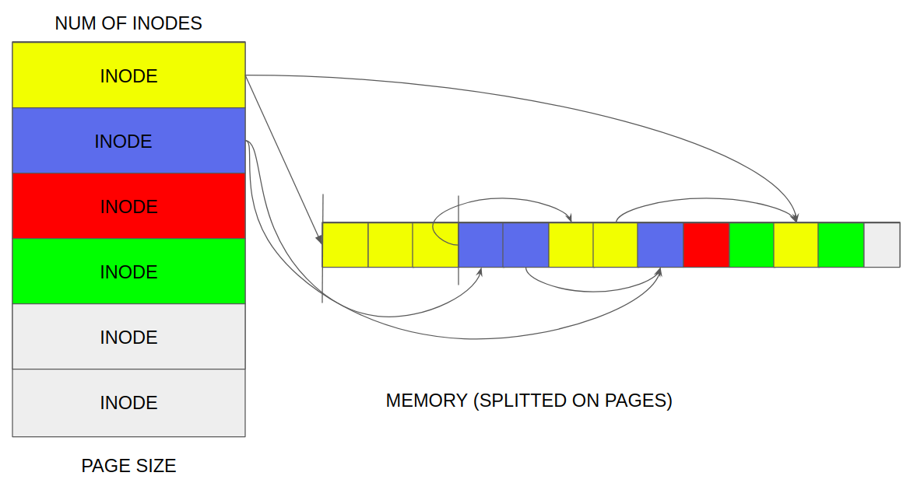

# OneFileSystem

BUILD INFORMATION:
[](https://travis-ci.com/ALEXSSS/OneFileSystem)
##

#### What I would want to do next:
1) add soft link support
2) add fine-grained locking mechanism instead of ReadWriteReentrantLock
3) add functionality to run de-fragmentation
4) write more tests 
5) add CLI interface

## Description

#### Glossary of OneFileSystem

_**Page**_ - the minimum allocated amount of memory (for example 4096 bytes).

_**Segment**_ - 1 or more contiguous pages.

--------------------------------

#### SuperBlock


SuperBlock is some amount of **inodes** which have following properties:

1) segment - start page where data is stored (pointing to the start of the segment's sequence)
2) size - size of stored data
3) counter - counter of hardlinks
4) fileType - only File and Directory are supported
5) lastSegment - pointer to the last segment in the segment's sequence

#### Storage

That is memory splitted on pages and also service which can allocate data or release data for user. During data allocation storage will 
try to allocate data less fragmented by using eager algorithm. As well during release of segments storage will merge all 
splitted segments for internal representation and will make them free again.
 
#### FileManager

FileManager will use both **storage** and **superBlock** services to keep track of allocated segments, putting data inside and emulating
commonly used file abstractions like file, directory, hardlink.

----------------------
#### How to use?

Initialise FileManager 

```
fileSystemConfiguration = FileSystemConfiguration.of(sifeOfFileSystem, sizeOfPage, numOfInodes, originalFile, true);
fileManager = new FileManager(fileSystemConfiguration);
```

After that you can create files and directories, providing where to create file or directory
as the first arg of `createDirectory` or `createFile` methods (`""` or `"."` is root).

```
fileManager.createDirectory("", "first"); // will create first directory in root
fileManager.createDirectory(".", "second"); // will create second directory in root
fileManager.createDirectory("./", "third"); // will create third directory in root
fileManager.createDirectory("./first", "fourth"); // will create fourth directory in first
fileManager.createDirectory("/first", "fifth"); // will create fifth directory in first

fileManager.createFile("./first/fifth", "someFile"); // will create file in directory /first/fifth with name someFile
```

Or you can create hardlink (throwing exception if you trying make cyclic hardlink)

```
// it will create hardlink on file ./first/fifth in directory second with name fifthHardLink
fileManager.createHardLink("./first/fifth", "/second", "fifthHardLink");
```

You can easily read content of directory 

```
// method will return list [("fourth", DIRECTORY), ("fifth", DIRECTORY)]
fileManager.getFilesInDirectory("./first");
// if you add boolean parameter, then you get list with files' sizes
fileManager.getFilesInDirectory("./first", true);
```

Write to the file from InputStream and read from OutputStream _(see example of the image saving below)_

```
// you can use version of this method with size of data specified, as it more effective for big files
fileManager.createFile(".", "someFile"); // will create someFile in the root
fileManager.writeToFileFromInputStream("./someFile", new ByteArrayInputStream(new byte[]{1,2,3,4,5}));

ByteArrayOutputStream out = new ByteArrayOutputStream();
fileManager.copyDataFromFileToOutputStream("./someFile", out);

System.out.println(Arrays.toString(out.toByteArray()));
// [1,2,3,4,5]
```

Or you can use internal API to read and write data

```
fileManager.createFile(".", "anotherFile");
// writing byte arrays to files
fileManager.writeToFile("./anotherFile", new byte[]{1,2,3,4,5,6});
fileManager.writeToFile("./anotherFile", new byte[]{7,8,9,10});

ByteStream byteStream = fileManager.readFileByByteStream("./anotherFile");
// you need to care about it if you use only internal api
System.out.println("You read file: "+ byteStream.getString()); // as name is stored in the file first
while (byteStream.hasNext()){
      System.out.print(byteStream.getByte() + " ");
}
// 1 2 3 4 5 6 7 8 9 10 
```

To remove file simply write

```
// remove file
fileManager.removeFile("./anotherFile");
// or whole directory (it will remove all files inside)
fileManager.removeFile("./second");
```

As well you can copy files inside OneFileSystem

```
// creation of what will be copied
fileManager.createFile("", "willBeCopied");
// let's write some data inside to check
fileManager.writeToFile("./willBeCopied", new byte[]{1, 2, 3, 4, 5});

// creation of directory to copy in
fileManager.createDirectory("./", "second");
fileManager.createDirectory("./second", "toCopyIn");

// how to copy
fileManager.copyFileToDirectory("./willBeCopied", "./second/toCopyIn", "ThatIsCopiedFile");

ByteStream byteStreamOfCopiedFile = fileManager.readFileByByteStream("./second/toCopyIn/ThatIsCopiedFile");
// reading copied file
System.out.println("You read file: " + byteStreamOfCopiedFile.getString()); // as name is stored in the file first
while (byteStreamOfCopiedFile.hasNext()) {
    System.out.print(byteStreamOfCopiedFile.getByte() + " ");
}
// 1 2 3 4 5
```

You can get file size

```
// to get size of file, but remember that first bytes used to store file's name
// for directories it will return accumullated size of all files inside (ignoring repetiotins due to hardlinks)
fileManager.getFileSize("./second/toCopyIn/ThatIsCopiedFile");
```

#### Examples

To see these snippets of code, go to the `FileManagerTest.forDocTest()`
and try `FileManagerTest.forDocImageTest()` where **image** is copied from **OS file system** 
to the file in **OneFileSystem** and back to another file in **OS specific file system**.